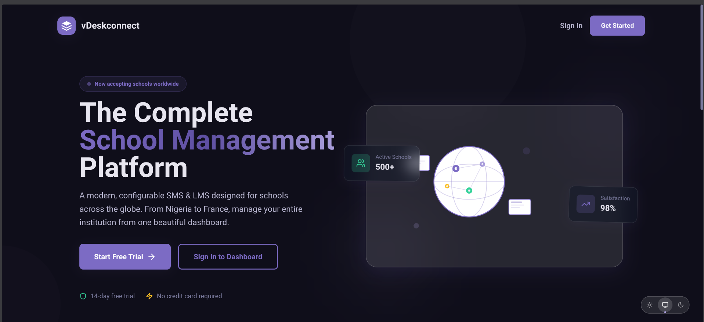
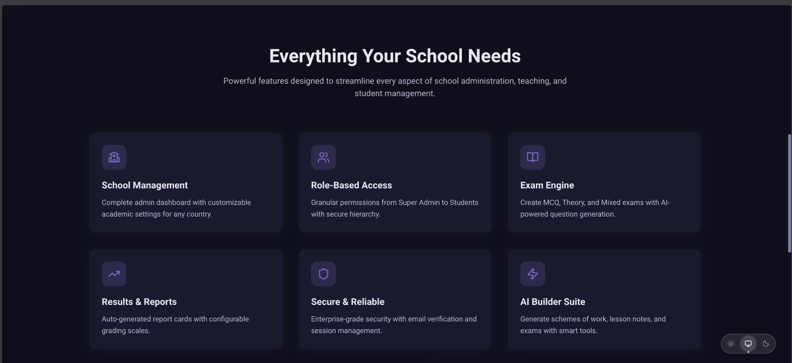
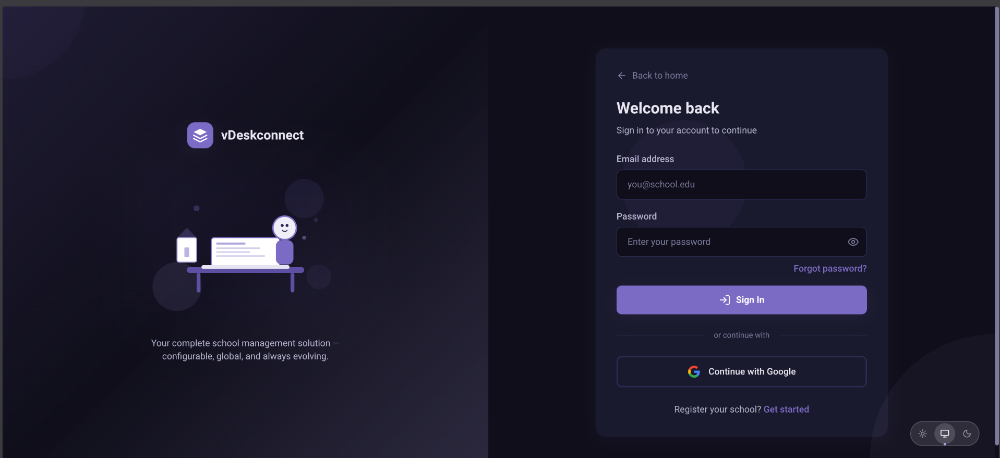
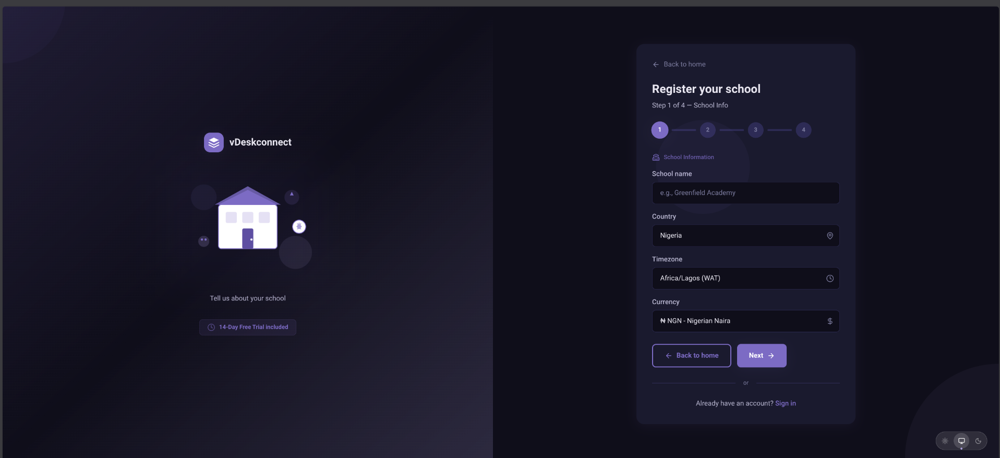
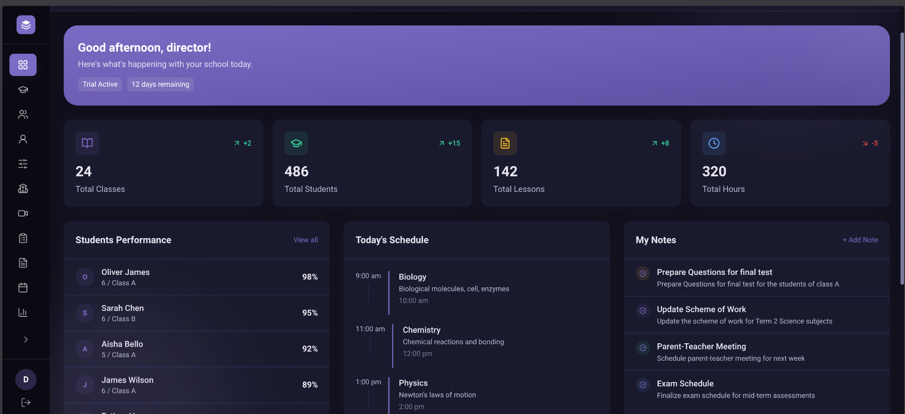
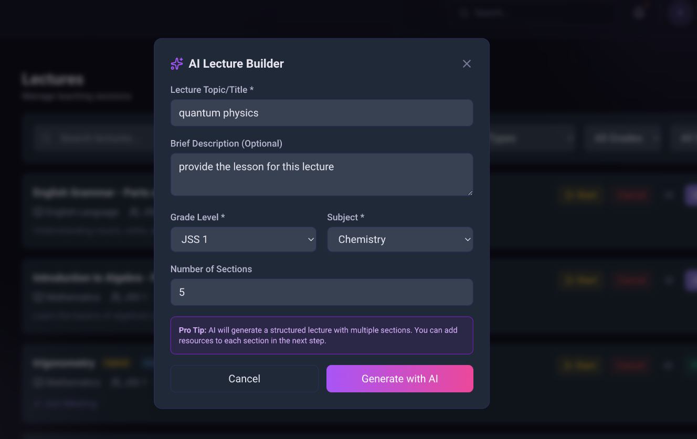
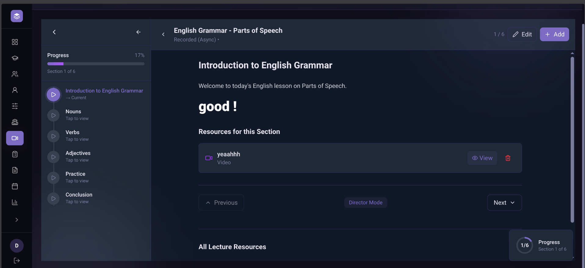
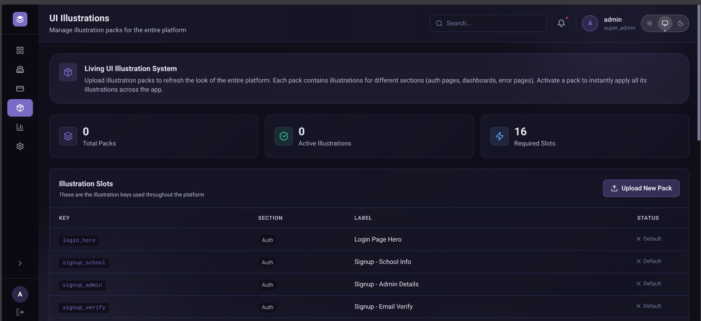
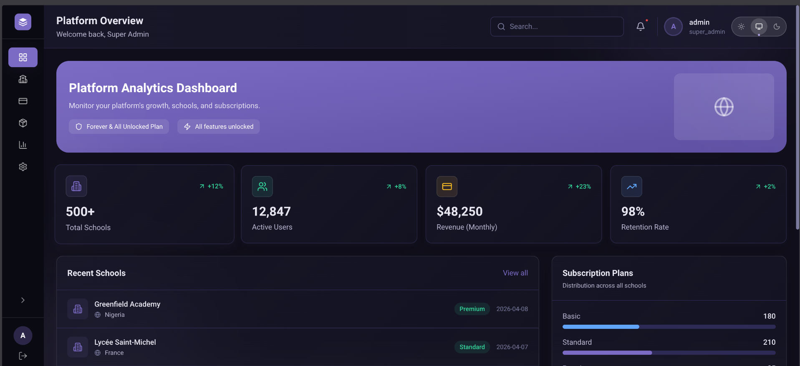

# vDeskConnect — Next-Gen Academic & Learning Management System

## 🚀 Overview

**vDeskConnect** is a state-of-the-art, multi-tenant, country-agnostic School Management System (SMS) and Learning Management System (LMS). Built for the modern educational era, it empowers institutions worldwide—from Nigeria to France, the UK, and beyond—to manage their entire academic lifecycle with zero code changes.

Whether you follow a 3-term Nigerian system, a semester-based American model, or a trimester-based French curriculum, vDeskConnect adapts dynamically to your school's unique DNA.

---

## ✨ Gallery

### Interface Highlights
| | |
|:---:|:---:|
|  |  |
| *Welcome & Onboarding* | *Secure Authentication* |
|  |  |
| *Multi-Step Registration* | *Director's Command Center* |
|  |  |
| *AI-Powered Content Generation* | *Immersive Lecture Player* |
|  |  |
| *Living UI Illustration System* | *Platform-Wide Analytics* |

---

## ✨ Key Differentiators

| Feature | vDeskConnect (Current) | Legacy Systems |
| :--- | :--- | :--- |
| **Academic Structure** | **100% Configurable** (Terms, Weeks, Grades) | Hardcoded / Rigid |
| **Exam Engine** | **MCQ + Theory + File Uploads** | MCQ Only or Manual |
| **AI Builder** | **AI-Assisted** Schemes, Notes, and Exams | Fully Manual |
| **Multi-Tenancy** | SaaS-Ready (Multi-Country Support) | Single School / Single Country |
| **UX/UI** | **Liquid Glassmorphism** & Dynamic Illustrations | Dated & Cluttered |

---

## 🛠️ Core Features (from TODO.md)

### 1. Academic Configuration Engine
*   **Dynamic Sessions & Terms**: Configure any number of terms, semesters, or trimesters.
*   **Custom Grade Levels**: Create your own hierarchy (JSS1, Grade 6, 6ème, etc.).
*   **Subject-to-Grade Mapping**: Assign core and elective subjects to specific grades.
*   **CA Configuration**: Custom continuous assessment week management.

### 2. AI-Powered Builder Suite
*   **AI Scheme of Work**: Generate a full term's curriculum plan in seconds.
*   **AI Lesson Notes**: Create detailed teacher guides based on curriculum topics.
*   **AI Exam Generator**: Build MCQ and Theory exams with automated question variants.
*   **AI Lecture Builder**: Structured multi-media lecture outlines with AI-generated sections.

### 3. Comprehensive Exam Engine
*   **Multi-Format Questions**: Support for MCQ, Theory, and Image/PDF uploads.
*   **Timed Assessments**: Auto-submission and countdown timers.
*   **Auto-Grading**: Instant marking for MCQ questions.
*   **Result Checking**: Secure PIN-based result portal for parents and students.

### 4. Advanced Lecture Management
*   **Sync Mode**: Integration with live video conferencing.
*   **Async Mode**: Pre-recorded multi-media content with sequential progress tracking.
*   **Hybrid Mode**: Best of both worlds—live sessions with recorded resources.

### 5. Management & Logistics
*   **Marketplace**: In-app bookstore for electronic and physical literature.
*   **Fee Management**: Receptionist-led tracking of payments and outstanding balances.
*   **Events Calendar**: Role-based school-wide calendar with RSVP tracking.
*   **Staff & Students**: Complete hierarchy-based user management with ban/delete audit trails.

---

## 🏗️ Technical Architecture

*   **Frontend**: Next.js 14+ (App Router) with Tailwind CSS.
*   **Design System**: Liquid Glassmorphism with custom illustration packs.
*   **Backend**: Laravel 11 (PHP 8.3) with Sanctum Authentication.
*   **Database**: PostgreSQL 16 (JSONB for flexible configurations).
*   **AI Stack**: Integrated Gemini 2.0 Flash / Smart Fallback Templates.
*   **Infrastructure**: Multi-tenant database isolation via `school_id`.

---

## 🔒 LICENSE & LEGAL NOTICE

> [!CAUTION]
> **PROPRIETARY AND CONFIDENTIAL SOFTWARE**
> 
> This software is **NOT** open source. It is the exclusive property of the author.
> 
> 🚫 **NO MODIFICATION:** No part of this project may be modified, adapted, or altered.
> 🚫 **NO REDISTRIBUTION:** Redistribution, resale, or sublicensing is strictly prohibited.
> 🚫 **NO UNAUTHORIZED ACCESS:** Unauthorized use, duplication, or access to the source code is a violation of copyright law.
> 
> **FALIURE TO ADHERE TO THESE TERMS IS A DANGEROUS GAME.** Unauthorized "touching" or tampering with this codebase will result in immediate legal action and prosecution to the fullest extent of the law. 
> 
> **ALL RIGHTS RESERVED.**

---

## 🧑‍💻 Author & Support

For licensing inquiries or enterprise deployment, contact the project owner directly.
